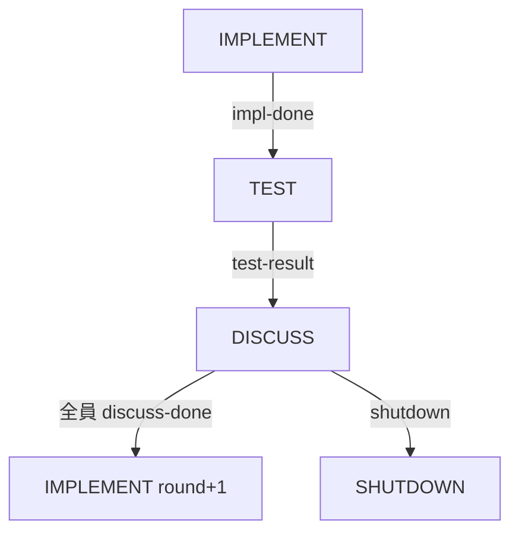

# なぜこの設計にしたか

## v3（6体・オーケストレーター型）の問題

前回の記事で作った v3 は、オーケストレーター 1体 + 専門エージェント 5体の計 6体構成でした。オーケストレーターがマージ・テスト・判断を担当して、5体が実装する。

動いたは動いたんですが、2つ致命的な問題がありました。

**1. オーケストレーターが単一障害点。** こいつが落ちると 5体が全員 `listen` で待ちぼうけ。Copilot はセッション切れで止まることがあるので、「一番落ちちゃいけないやつが、一番落ちやすい」という状況でした。

**2. オーケストレーターの仕事の大半が「待つこと」。** 5体のマージリクエストが揃うまで待って、テスト結果を見て、議論のまとめを待って…。1体ぶんの Copilot リソースが待機に消えてるのはもったいない。

**「じゃあオーケストレーター消せばよくない？」** という発想で v6 を作りました。

## 全体像

```
┌──────────────────────────────────────────────────┐
│           agent_sync server (TCP :9800)           │
│     フェーズ管理 / メッセージキュー / バリア同期     │
└──┬──────────────┬──────────────┬─────────────────┘
   │              │              │
 VS Code        VS Code        VS Code      (N タブ)
 Agent-A        Agent-B        Agent-C ...
   │              │              │
 ┌┴┐            ┌┴┐            ┌┴┐
 │H│            │H│            │H│           H = Hook 3本
 └┬┘            └┬┘            └┬┘
  └──── TCP ─────┴──── TCP ─────┘
```

全エージェントが対等なピア。特権的な役割を持つエージェントはいません。「誰がこのラウンドの実装者か」はサーバーが管理するけど、オーケストレーターのような「止まったら全体が詰む」ロールは存在しない。

## フラット構成にした理由

- **どのエージェントが落ちても他が動き続けられる。** 2体なら片方が落ちても、サーバーに `say` コマンドで介入すれば復帰できる。v3 だとオーケストレーターが落ちた時点で詰み
- **全員が実装 or テストに参加できる。** 待機専門のロールがないので、リソースが無駄にならない
- **スケールが簡単。** 環境変数 `AGENTS_LIST` を変えてサーバーを再起動するだけで 3体目、4体目を追加できる

## 同一ブランチにした理由

v3 では 5体が別ブランチで作業していて、オーケストレーターがマージする MERGE フェーズがありました。v6 では全員が同じブランチで動きます。

**「コンフリクトしないの？」** という疑問はもっともなんですが、IMPLEMENT フェーズで `implementer` を 1人に絞ることで回避しています。implementer 以外は listen で待機するか、別の非競合タスク（ドキュメント生成、テスト追加など）をやる。

ブランチを分けないことで MERGE フェーズが丸ごと消えて、サイクルが 1段階シンプルになりました。

## フェーズサイクル



| フェーズ | やること | 次への遷移 |
|---------|---------|-----------|
| **IMPLEMENT** | implementer が実装。他は待機 or 並行タスク | `impl-done` コマンド |
| **TEST** | テスト実行 → 結果報告 | `test-result` コマンド |
| **DISCUSS** | 全員で議論。次ラウンドの方針を決める | 全員が `discuss-done` |
| **SHUTDOWN** | 終わり。全エージェントに通知 | `shutdown` コマンド |

v3 にあった MERGE フェーズがないのがポイントです。

DISCUSS で `discuss-done` が全エージェントから届くと、サーバーが自動で round_number をインクリメントして IMPLEMENT に戻します。人間の判断は不要。

## プロトコル

### TCP + JSON の改行区切り

HTTP でも WebSocket でもなく、生の TCP にしたのは v3 と同じ理由です。**Copilot がターミナルで CLI を叩くだけで通信できる** から。標準出力に JSON が出るだけなので、Copilot が自然に読めます。

```json
{"cmd": "join", "agent": "agent-a"}
→ {"ok": true, "message": "Joined as agent-a", "phase": "IMPLEMENT"}
```

### メールボックス方式

各エージェントに専用のメッセージキュー（メールボックス）があります。

- `send`: 特定のエージェントにメッセージを送る
- `broadcast`: 全員に送る
- `listen`: メッセージが届くまで待つ（タイムアウト付き）
- `peek`: メッセージ数を非ブロッキングでチェック（Hook から使う用）

`listen` は `asyncio.Event` でブロックしていて、他のコマンドがメッセージを追加すると `Event.set()` で起こします。

## N-agent 対応

エージェント数は環境変数で変えられます:

```powershell
# 2体（デフォルト）
$env:AGENTS_LIST = "agent-a,agent-b"

# 3体にしたいとき
$env:AGENTS_LIST = "agent-a,agent-b,agent-c"
```

サーバー内部ではこう解決しています:

```python
AGENTS = tuple(a.strip() for a in os.environ.get(
    "AGENTS_LIST", "agent-a,agent-b"
).split(",") if a.strip())
```

`discuss-done` の遷移判定も `len(AGENTS)` で動的に決まるので、3体でも4体でもそのまま動きます。

## サーバーの状態管理

サーバーは全状態をメモリ上のデータクラスで管理しています。

```python
@dataclass
class ServerState:
    phase: str = "IMPLEMENT"
    round_number: int = 1
    agents: dict[str, dict]           # 参加エージェント
    mailboxes: dict[str, list[dict]]  # メッセージキュー
    implementer: str = ""             # 今ラウンドの実装者
    discuss_done: set                 # discuss-done 済みの人
    discussion: list[dict]            # 議論ログ
    test_result: dict | None          # 最新テスト結果
```

永続化は一切していません。サーバーが落ちたら状態は消えます。これは意図的で、1セッション（数時間）で完結する前提だからです。長期的な状態は git に入っているので、サーバーが保持する必要がないという判断です。
